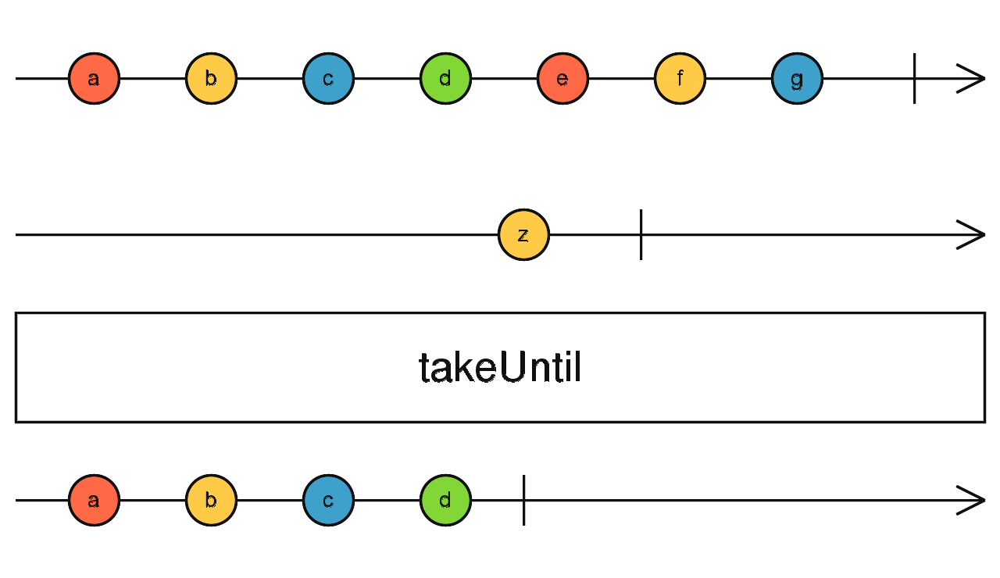

# NG-WYY

> 使用Angular14搭建的网易云web端。

## 一、模块化设计

------

1. `CoreModule`包含核心模块，`ShareModule`包含共享的UI、基础等模块。

2. `CoreModule`添加以下代码，防止其他Module引入。

   ```typescript
   export class CoreModule {
     constructor(@SkipSelf() @Optional() parentModule: CoreModule) {
       if (parentModule) {
         throw new Error('CoreModule can only be imported by AppModule.')
       }
     }
   }
   ```


## 二、页面布局与服务类

------

### 2.1 页面布局

1. 使用`nz-layout`进行布局。
2. 将`header.wrap`分为左右部分进行处理

### 2.2 服务类

1. 对隶属于`services.module`的服务类，设置`providedIn: ServicesModule`

2. 公共的字符常量可以设置为`InjectionToken`，并在module中声明并导出。

   ```typescript
   export const API_CONFIG = new InjectionToken('ApiConfigToken');
   
   @NgModule({
     declarations: [],
     imports: [],
     providers: [
       {
         provide: API_CONFIG, useValue: 'http://localhost:3000/'
       }
     ]
   })
   export class ServicesModule {
   }
   ```

3. 其他类使用2中字符常量时，可将其进行注入。

   ```typescript
   constructor(@Inject(API_CONFIG) private uri: string) { }
   ```

4. ```typescript
   this.http.get<BannerList>(this.uri + 'banner')
   ```


## 三、走马灯——父子组件通信、模板、变更检测

------

### 3.1 父子组件通信

1. `@Input()`作为子组件的属性，即使用**[ ]**

2. `@Output() new EventEmitter<T>()`作为子组件的方法，即使用**( )**

3. 示例：

   `WyCarousel`

   ```typescript
   @Input() activeIndex = 0;
   @Output() changeSlide = new EventEmitter<'pre' | 'next'>();
   ```

   `homel`

   ```typescript
   <app-wy-carousel #wyCarousel 
   	[activeIndex]="carouselActiveIndex" 
   	(changeSlide)="onChangeSlide($event)"
   >
   ```

### 3.2 模板

1. 修改走马灯Dot渲染模板，需要传入`TemplateRef<{ $implicit: number }>`

   `WyCarousel`

   ```typescript
   <ng-template #dot let-number>
         <span class="dot" [class.active]="activeIndex === number"></span>
   </ng-template>
   
   @ViewChild('dot', {static: true}) dotRef!: TemplateRef<any>;
   ```

   `homel`

   ```html
   <app-wy-carousel #wyCarousel></app-wy-carousel>
   <nz-carousel
         nzAutoPlay
         nzEffect="fade"
         [nzDotRender]="wyCarousel.dotRef"
         (nzBeforeChange)="onBeforeChange($event)"
   >
   ```

### 3.3 变更检测

1. 由于`wy-carousel`仅在`@Input`发生变化时需要检测数据更新，故可以修改该组件的变更检测策略

   ```typescript
   @Component({
     selector: 'app-wy-carousel',
     templateUrl: './wy-carousel.component.html',
     styleUrls: ['./wy-carousel.component.less'],
     changeDetection: ChangeDetectionStrategy.OnPush
   })
   ```

2. 官方示例：下面的例子为组件设置了 `OnPush` 变更检测策略（`CheckOnce` 而不是默认的 `CheckAlways`），然后每隔一段时间强制进行第二轮检测。

   ``` typescript
   @Component({
     selector: 'app-root',
     template: `Number of ticks: {{numberOfTicks}}`,
     changeDetection: ChangeDetectionStrategy.OnPush,
   })
   
   class AppComponent {
     numberOfTicks = 0;
   
     constructor(private ref: ChangeDetectorRef) {
       setInterval(() => {
         this.numberOfTicks++;
         // require view to be updated
         this.ref.markForCheck();
       }, 1000);
     }
   }
   ```


## 四、首页——管道、Resolver、获取路由数据

------

### 4.1 管道

1. 创建管道`ng g pipe <pipe-name>`，实现继承方法`PipeTransform.transform`

2. 使用时，直接使用其名称

   ```typescript
   @Pipe({
     name: 'playCount'
   })
   ```

### 4.2 Resolver与获取路由数据

1. 防止数据未加载导致页面显示错误。Resolver可以在导航期间解析数据，提供给其他组件使用。路由器会在最终激活路由之前等待数据被解析。

   ```typescript
   interface Resolve<T> {
     resolve(route: ActivatedRouteSnapshot, state: RouterStateSnapshot): Observable<T> | Promise<T> | T
   }
   ```

2. 为防止1中情况出现，可以在Resolver中请求数据，然后通过`resolve`方法返回。

   ```typescript
   const routes: Routes = [
     {
       path: 'home', component: HomeComponent, data: {title: '发现'}, 
       resolve: {homeData: HomeResolver}
     }
   ];
   ```

3. 使用`ActivatedRoute.data`获取路由数据，为方便获取数据，可使用es6的解构语法

   ```typescript
   this.activatedRoute.data.pipe(
         map(({homeData, title}) => homeData)
       ).subscribe((res: HomeDataType) => {
         const [banners, hotTags, songSheetList, singers] = res;
         this.banners = banners;
         this.hotTags = hotTags;
         this.songSheetList = songSheetList;
         this.singers = singers;
       })
   ```


## 五、滑块组件

### 5.1 OnChanges接口

1. 组件或指令的属性以其属性名称存储在`SimpleChange`哈希表中。

   ```typescript
   ngOnChanges(changes: SimpleChanges): void {
       if (changes['wyLength']){
         if (this.wyVertical){
           this.style.height = this.wyLength + '%';
           this.style.left = null;
           this.style.width = null;
         } else {
           this.style.width = this.wyLength + '%';
           this.style.bottom = null;
           this.style.height = null;
         }
       }
     }
   ```

### 5.2 主动变更检测

1. 由于更改变更检测策略为`ChangeDetectionStrategy.OnPush`，仅当输入数据发生变化时，Angular才对视图进行重新渲染，故当需要主动出发变更检测时，使用`ChangeDetectorRef.markForCheck()`强制检测。

   ```typescript
   constructor(private ref: ChangeDetectorRef) {
       setInterval(() => {
         this.numberOfTicks++;
         // require view to be updated
         this.ref.markForCheck();
       }, 1000);
     }
   ```

### 5.3 常用的rxjs operators

1. `fromEvent:`创建一个 Observable，它会发出来自给定事件目标的特定类型的事件。

   ``` typescript
   const clicks = fromEvent(document, 'click');
   clicks.subscribe(x => console.log(x));
   ```

2. `switchMap:`将每个值映射到一个 Observable，然后展平所有这些内部 Observable。

   ``` typescript
   const switched = of(1, 2, 3).pipe(switchMap(x => of(x, x ** 2, x ** 3)));
   switched.subscribe(x => console.log(x));
   // outputs
   // 1
   // 1
   // 1
   // 2
   // 4
   // 8
   // 3
   // 9
   // 27
   ```

3. `tap:`当你想借助某个通知来影响外部状态而不想更改此通知时使用。该方法与`map`不同点在于，它返回原Observable，不会污染源数据。

   ``` typescript
    source.moveResolved$ = fromEvent(this.doc, move).pipe(
           filter(filterFunc),
           tap(silentEvent),
           map(this.getPosition.bind(this)),
           distinctUntilChanged(),
           map((position: number) => this.findClosestValue(position)),
           distinctUntilChanged(),
           takeUntil(source.end$)
         );
   ```

4. `distinctUntilChanged:`当source observable不同时，才将其emit。

5. `takeUntil:`发送源 Observable 发出的值，直到 `notifier` Observable 发出一个值。

   

6. `mergeWith:`将所有 Observable 的值合并为单个可观察结果。

   ``` typescript
   this.dragStart$ = mouse.startPlucked$!.pipe(mergeWith(touch.startPlucked$!));
   this.dragMove$ = mouse.moveResolved$!.pipe(mergeWith(touch.moveResolved$!));
   this.dragEnd$ = mouse.end$!.pipe(mergeWith(touch.end$!));
   ```

### 5.4 type和interface比较

1. 相同点：

   * 都可以用来描述一个对象或一个函数
   * 都允许extends

2. 不同点：

   * type 可以声明基本类型别名，联合类型，元组等类型

     ``` typescript
     // 基本类型别名
     type Name = string
     
     // 联合类型
     interface Dog {
         wong();
     }
     interface Cat {
         miao();
     }
     type Pet = Dog | Cat
     
     // 具体定义数组每个位置的类型
     type PetList = [Dog, Pet]
     ```

   * type 语句中还可以使用 typeof 获取实例的类型进行赋值

     ```typescript
     // 当你想获取一个变量的类型时，使用 typeof
     let div = document.createElement('div');
     type B = typeof div
     ```

   * interface 能够声明合并

     ``` typescript
     interface User {
       name: string
       age: number
     }
     
     interface User {
       sex: string
     }
     
     /*
     User 接口为 {
       name: string
       age: number
       sex: string 
     }
     */
     ```

3. 总结：type用以描述**类型关系**，interface适用面更广

### 5.5 原生document和注入document

1. 使用方法：`@Inject(DOCUMENT) private doc: Document`，该document代表rendering context
2. 当应用程序上下文和渲染上下文不同时（比如，在 Web Worker 中运行应用程序时），document 可能在应用程序上下文中不可用。

### 5.6 keyof关键字

1. 通过 keyof 操作符提取类型属性的名称。

   ```typescript
   interface Person {
     name: string;
     age: number;
     location: string;
   }
   
   type K1 = keyof Person; // "name" | "age" | "location"
   type K2 = keyof Person[];  // number | "length" | "push" | "concat" | ...
   type K3 = keyof { [x: string]: Person };  // string | number
   ```

2. 使用场景：约束传入参数类型，在编译时报错。

   ``` typescript
   function prop(obj: object, key: string) {
     return obj[key];
   }
   ```

   在上述代码中，由于索引`{}`类型无法通过`string`进行索引，故可采用下述代码进行修改：

   ``` typescript
   function prop<T extends object, K extends keyof T>(obj: T, key K)){
       return obj[key];
   }
   ```

   ``` typescript
   type Todo = {
     id: number;
     text: string;
     done: boolean;
   }
   
   const todo: Todo = {
     id: 1,
     text: "Learn TypeScript keyof",
     done: false
   }
   
   function prop<T extends object, K extends keyof T>(obj: T, key: K) {
     return obj[key];
   }
   
   const id = prop(todo, "id"); // const id: number
   const text = prop(todo, "text"); // const text: string
   const done = prop(todo, "done"); // const done: boolean
   const date = prop(todo, "date"); // Argument of type '"date"' is not assignable to parameter of type '"id" | "text" | "done"'.
   ```

### 5.7 window与HTMLElement.ownerDocument.defaultView

1. 因为当前元素所属的document可能与当前document不同。

### 5.8 实现`ngModel`，实现`ControlValueAccessor`接口

1. 注入自身，指定`NG_VALUE_ACCESSOR`用以为表单控件提供`ControlValueAccessor`

   ``` typescript
   providers:[{
       provide: NG_VALUE_ACCESSOR,
       useExisting: forwardRef(() => WySliderComponent),
       multi: true
   }]
   ```

2. 实现接口

   ```typescript
   interface ControlValueAccessor {
     writeValue(obj: any): void // 将新值写入元素，当请求从模型到视图的编程更改时，表单 API 会调用此方法以写入视图。
       
     registerOnChange(fn: any): void // 注册一个回调函数，该控件的值在 UI 中更改时将调用该回调函数。当值从视图传播到模型时，表单 API 会在初始化时调用此方法以更新表单模型。注意，在自己的value accessor中保存该函数。
     
     registerOnTouched(fn: any): void // 注册一个在初始化时由表单 API 调用的回调函数，以在失去焦点时(on blur)更新表单模型。
     
     setDisabledState(isDisabled: boolean)?: void // 当控件状态更改为 “DISABLED” 或从 “DISABLED” 更改时，表单 API 要调用的函数。根据其状态，它会启用或禁用适当的 DOM 元素。
   }
   ```

3. 保存回调函数，即上述代码注释中的注意部分

   ``` typescript
   private onValueChange(value: number): void{}
   private onTouched(): void{}
   
   registerOnChange(fn: (value: number) => void): void {
       this.onValueChange = fn;
   }
   
   registerOnTouched(fn: () => void): void {
       this.onTouched = fn;
   }
   ```

   


